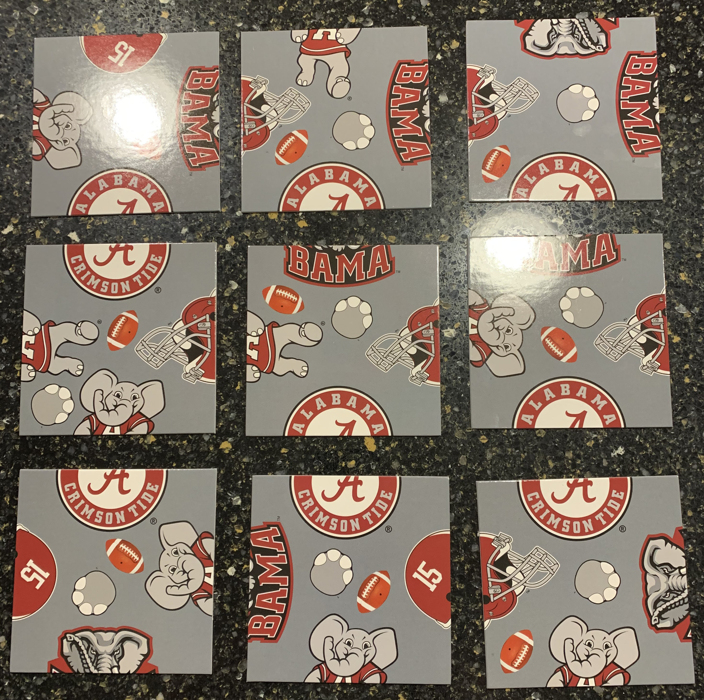
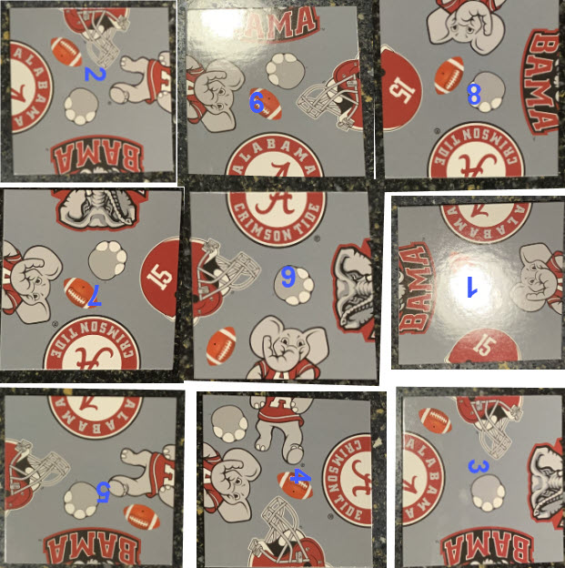

# sim-scrambleSquares
Solution for Scramble Squares

There are 9! possible orderings. There are 4 rotations possible at each tile. Thus
for each ordering, there are 4^9 possible positions. 9! * 4^9 = 95,126,814,720
layouts to try.

Here is a scientific solution (instead of my brute-force approach):

https://users.wfu.edu/masonsk/scramblesquares.pdf

Frank's pieces (I numbered them on the back):

Here is the first solution my code found:

